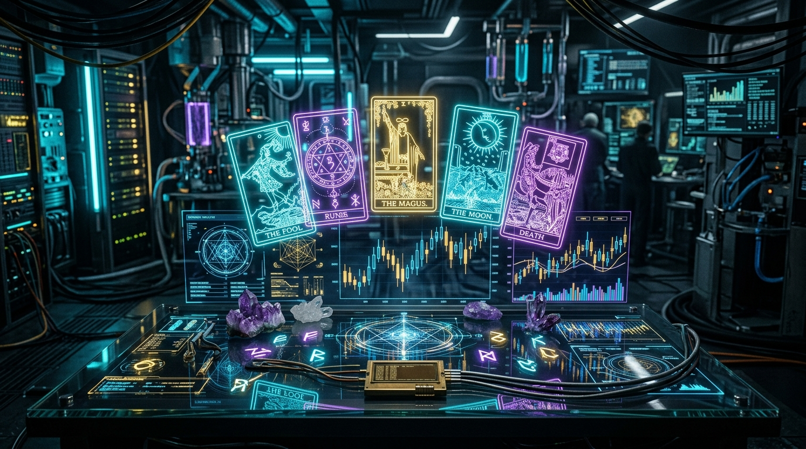

  

# 🔮 DarkAIs Quant Tarot & Cyber Oracle
**3D Holographic Crypto Tarot Altar, 22 Major Arcana Cards & Quantitative AI Market Prophecies**

 

### 🔮 [Click Here to Consult the DarkAIs Cyber Oracle Live](https://karidasd.github.io/quant-tarot/)

---

## 🃏 Features
- 🎴 **22 Major Arcana Cyber Quant Cards:** Featuring *The Degenerate (The Fool)*, *The Algorithm (The Magician)*, *The Institutional Whale (The Emperor)*, *The Liquidation (Death)*, *The 1000x Moonshot (The Star)*, and *The Agent Swarm (The World)*.
- ✨ **3D Holographic Card Flipping:** Built with pure CSS 3D matrix transforms and glowing rune backs.
- 🔮 **3 Interactive Spreads:**
  - 3-Card Timeline (Genesis / Volatility / Destiny)
  - 1-Card Daily Alpha
  - 5-Card Deep Market Spread
- 📜 **AI Fortune Synthesizer:** Detailed risk metrics, sentiment ratings, alpha directives, and propitious trading pair recommendations.
- 📖 **Interactive Grimoire (`deck.html`):** Explore the complete mathematical and psychological lore of all 22 cards.

---

  <i>Created with passion by <a href="https://karidasd.github.io/">Dimitris Karydas</a> • Part of the DarkAIs Open-Source Ecosystem.</i>

